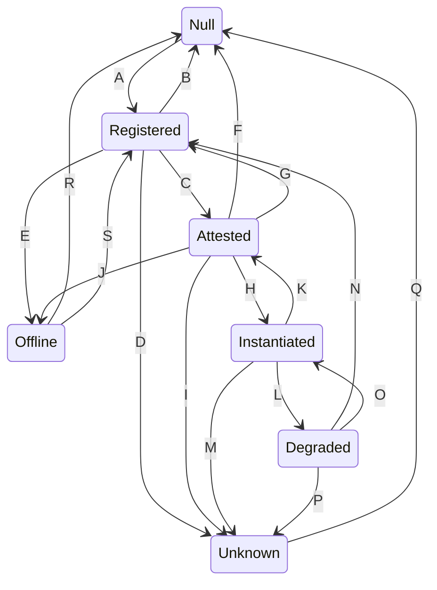

Transition | Trigger
--- | ---
A | provider_register_geode()
B | remove_geode() timeout(being Registered)
C | attestor_attest_geode()
D | report_misconduct()
E | provider_offline_geode()
F | remove_geode()
G | attestor_exit() min_att_num⬆
H | provider_confirm_dispatch()
I | report_miconduct() timeout(provider_confirm_dispatch())
J | provider_offline_geode()
K | provider_uninstantiate_geode()
L | attestor_exit() min_att_num⬇
M | report_misconduct() timeout(provider_start_serving())
N | provider_uninstantiate_geode()
O | attestor_attest_geode() min_att_num⬆
P | report_misconduct() timeout(provider_start_serving()) timeout(being Degraded) && !DegradeMode
Q | remove_geode() timeout(being Unknown)
R | remove_geode()
S | provider_online_geode()

